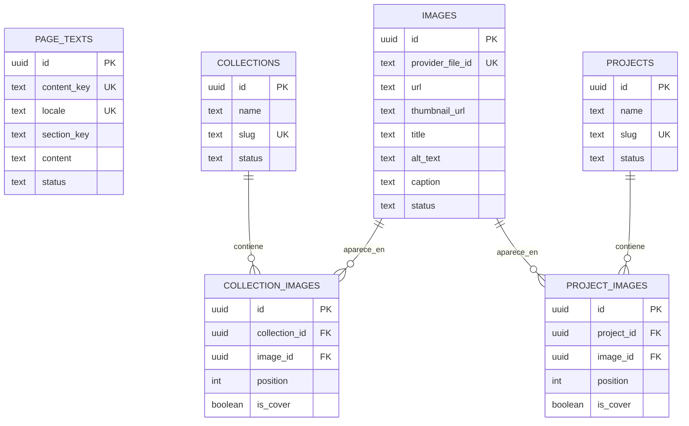

# Modelo de datos — Simbionte Joyas

Este modelo cubre el contenido público de la página, las imágenes alojadas en ImageKit y su asociación ordenada con colecciones y proyectos. Está implementado en [`migrations/20260820212804_create-content-model.sql`](../migrations/20260820212804_create-content-model.sql).

## Relaciones

## Tablas

### `page_texts`

Guarda los textos editables de la página. `content_key` es la clave estable que consume el frontend, por ejemplo `home.hero.title`; `admin_label` es el nombre comprensible que mostrará el futuro panel.

- La combinación `content_key + locale` es única y deja preparado el contenido para más de un idioma.
- `page_key`, `section_key` y `sort_order` permiten agrupar y ordenar el contenido sin acoplarlo al diseño visual.
- `content_format` admite texto plano o Markdown. Si se usa Markdown, el frontend deberá sanitizar el HTML resultante.
- `status` permite trabajar con borradores sin publicarlos.

Claves iniciales sugeridas para la página actual:

| Sección | Claves |
| --- | --- |
| Hero | `home.hero.eyebrow`, `home.hero.title`, `home.hero.description`, `home.hero.cta`, `home.hero.caption` |
| Obra | `home.work.eyebrow`, `home.work.title`, `home.work.gallery_hint` |
| Sobre mí | `home.about.eyebrow`, `home.about.title`, `home.about.body` |
| Proceso | `home.process.eyebrow`, `home.process.title` |
| Contacto | `home.contact.eyebrow`, `home.contact.title` |

El seed inicial completo está en [`database/seeds/page-texts.sql`](../database/seeds/page-texts.sql). Incluye también SEO, navegación, las tarjetas de proceso, la etiqueta de Instagram y los textos editables del pie de página. Usa `ON CONFLICT` para poder ejecutarse más de una vez sin duplicar registros.

Los títulos, textos alternativos y descripciones de fotografías no se incluyen en este seed: se registrarán en `images` junto con los identificadores y URLs definitivos de ImageKit.

### `images`

Representa una foto una sola vez, aunque se muestre en varios lugares.

- `provider_file_id` guarda el `fileId` de ImageKit, necesario para actualizar o eliminar el archivo mediante su API.
- `url` y `thumbnail_url` guardan los enlaces entregados por ImageKit.
- `provider_file_path`, dimensiones, tipo MIME y tamaño permiten administrar y renderizar la imagen sin volver a consultar ImageKit en cada visita.
- `title`, `alt_text` y `caption` son los textos editables asociados a cada foto. `alt_text` se mantiene separado por accesibilidad.
- `provider` evita acoplar las relaciones a ImageKit y facilita cambiar de proveedor en el futuro.

La clave privada de ImageKit nunca debe guardarse en esta tabla ni exponerse en variables públicas del frontend. Las cargas y operaciones administrativas deberán firmarse desde un entorno de servidor.

### `collections` y `projects`

Ambas tablas tienen nombre, URL amigable (`slug`), descripción, orden y estado editorial. Se mantienen separadas porque son conceptos distintos y probablemente evolucionarán con atributos propios.

Para publicar una colección o un proyecto se requiere `published_at`. Un registro nuevo comienza como `draft`.

### `collection_images` y `project_images`

Son las relaciones muchos-a-muchos entre imágenes y colecciones/proyectos.

- Una imagen puede pertenecer a varias colecciones o proyectos sin duplicarse.
- `position` controla el orden de la galería.
- `is_cover` marca la portada y se limita a una por colección o proyecto.
- Al borrar una colección o proyecto solo se eliminan sus relaciones; la imagen continúa disponible para otros usos.

## Acceso público y administración

Todas las tablas usan Row-Level Security. Los roles públicos de InsForge (`anon` y `authenticated`) solo pueden leer registros publicados. La migración no concede permisos públicos de escritura.

El futuro panel administrativo deberá usar autenticación y políticas específicas para administradores, o realizar las mutaciones desde una función de servidor. Esas reglas se definirán junto con el panel para no asumir todavía quiénes serán los administradores.

## Flujo previsto con ImageKit

1. El servidor genera la autenticación de carga de ImageKit.
2. El navegador carga el archivo directamente a ImageKit.
3. La respuesta de ImageKit entrega `fileId`, `filePath`, `url`, `thumbnailUrl`, ancho, alto y tamaño.
4. El servidor crea la fila correspondiente en `images`, inicialmente como `draft`.
5. El panel asocia la imagen con una colección o proyecto y define su posición/portada.
6. Cuando el contenido esté listo, cambia su estado a `published`.

## Migración futura de InsForge

El esquema usa PostgreSQL estándar, UUIDs, claves foráneas, índices y RLS. Para moverlo a otro proyecto de InsForge se podrá exportar la base o aplicar el historial de migraciones al nuevo proyecto. Los archivos de ImageKit no dependen del proyecto de base de datos: las referencias permanecen válidas mientras se conserven `provider_file_id` y las URLs.

Antes de aplicar esta migración a un proyecto remoto hay que vincular el repositorio, inspeccionar el esquema real y generar/sincronizar el historial de migraciones con la CLI de InsForge.

## Referencias técnicas

- [Respuesta de carga de ImageKit](https://imagekit.io/docs/api-reference/upload-file/upload-file): campos `fileId`, `filePath`, `url`, `thumbnailUrl`, dimensiones y tamaño.
- [RLS para contenido público en InsForge](https://insforge.dev/integrations/clerk): patrón de lectura pública con políticas para `anon` y `authenticated`.
